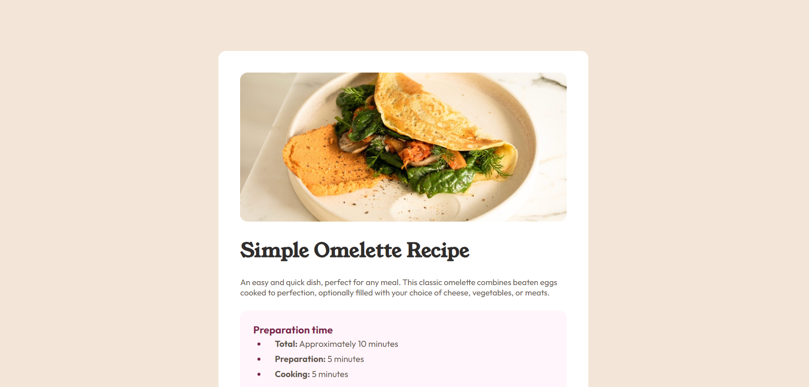

# Frontend Mentor - Recipe page solution

This is a solution to the [Recipe page challenge on Frontend Mentor](https://www.frontendmentor.io/challenges/recipe-page-KiTsR8QQKm). Frontend Mentor challenges help you improve your coding skills by building realistic projects. 

## Table of contents

- [Overview](#overview)
  - [The challenge](#the-challenge)
  - [Screenshot](#screenshot)
  - [Links](#links)
- [My process](#my-process)
  - [Built with](#built-with)
  - [What I learned](#what-i-learned)
  - [Continued development](#continued-development)
  - [Useful resources](#useful-resources)
- [Author](#author)
- [Acknowledgments](#acknowledgments)

**Note: Delete this note and update the table of contents based on what sections you keep.**

## Overview

### Screenshot

**Note: Delete this note and the paragraphs above when you add your screenshot. If you prefer not to add a screenshot, feel free to remove this entire section.**

### Links

- Solution URL: [Add solution URL here](https://your-solution-url.com)
- Live Site URL: **Will be adding soon!**

## My process

I have Implemented this Project using the below process.

1. Organized the HTML Page with the Text provided by FrontEnd-Mentor Challenge Base Code.
2. Added CSS styling for the Desktop View.
3. Then, added CSS Styling for the Mobile View.
4. Uploaded the Code onto GitHub Repo.
5. Made the website live using the GitHub Hosting Services/GitHub Pages.

### Built with

- Semantic HTML5 markup
- CSS custom properties
- Flexbox
- Mobile-first workflow
- Google Fonts

### Useful resources

- [Geeks for Geeks ](https://www.geeksforgeeks.org/html-tutorial/?ref=gcse) - This helped me for HTML & CSS. 
- [W3Schools](https://www.w3schools.com/html/html_tables.asp) - This is a amazing website, which have articles related to our senarios that helped me solving the issues in my Development Journey. I'd recommend it to anyone.

## Author

- Website - [Bibhu Prasad Panda](https://github.com/BibhuPrasadPanda97)
- Frontend Mentor - [@BibhuPrasadPanda97](https://www.frontendmentor.io/profile/BibhuPrasadPanda97)
